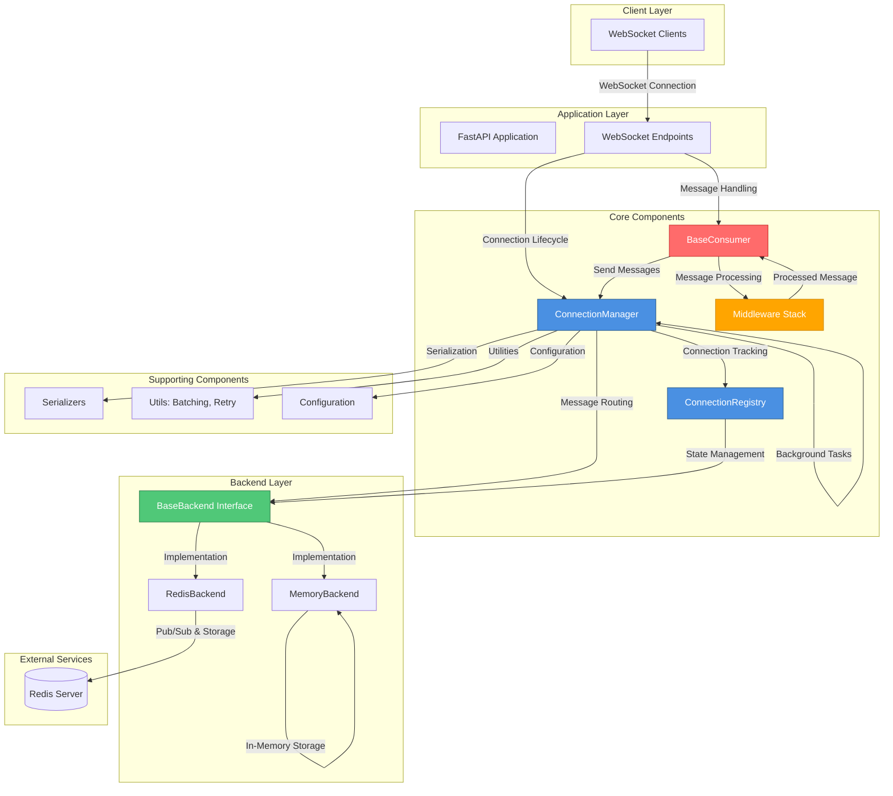
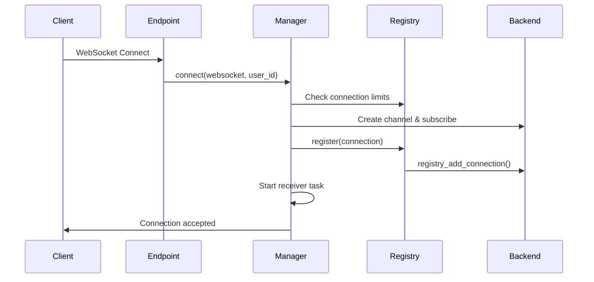
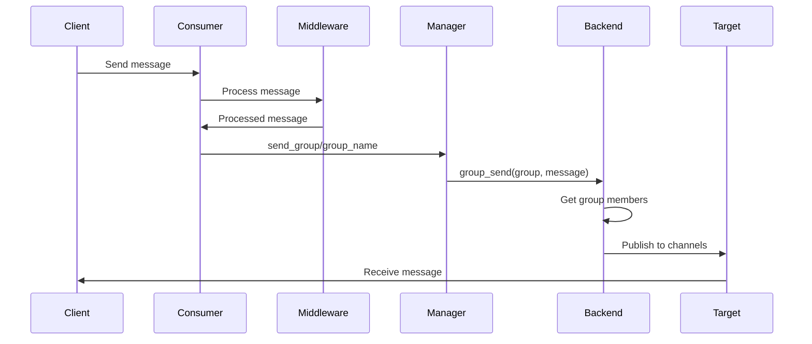

# AgentCore

A high-performance, distributed WebSocket messaging system built with FastAPI. AgentCore provides a robust foundation for real-time applications with support for single-server and multi-server deployments, group messaging, connection management, and extensible middleware.

## Features

- **WebSocket Connection Management**: Robust connection lifecycle management with heartbeat monitoring and automatic cleanup
- **Distributed Architecture**: Support for both in-memory (single-server) and Redis-backed (multi-server) deployments
- **Group Messaging**: Efficient group-based messaging with cross-server support
- **Broadcast Messaging**: Global message broadcasting across all connections
- **Connection Limits**: Configurable per-user and total connection limits
- **Middleware Support**: Chainable middleware for message processing, validation, rate limiting, and logging
- **Heartbeat Monitoring**: Automatic connection health checks and dead connection cleanup
- **Serialization**: Flexible message serialization (JSON, orjson, pickle)
- **Structured Error Handling**: Typed error categories with contextual responses and retry hints
- **REST & Persistence**: Optional REST endpoints plus pluggable storage (example ships with SQLite-backed history)
- **Statistics & Monitoring**: Built-in connection statistics and activity tracking

## Architecture



## System Components

### ConnectionManager

The central orchestrator for WebSocket connections. Manages:
- Connection establishment and teardown
- Group membership management
- Message routing (personal, group, broadcast)
- Heartbeat monitoring and cleanup
- Connection limits enforcement
- Background task coordination (heartbeat, statistics, broadcast)
- Optional toggles for background loops (`log_stats`, `enable_heartbeat`) and auto-generated `server_instance_id` for distributed tracing

### ConnectionRegistry

Maintains an in-memory registry of active connections and coordinates with the backend for distributed state management:
- Local connection state tracking
- User-to-connection mapping
- Group membership management
- Backend synchronization for cross-server visibility

### Backend Layer

Abstract interface (`BaseBackend`) with two implementations:

**MemoryBackend**: Single-server deployment
- In-memory storage for channels and groups
- Fast local lookups
- No external dependencies

**RedisBackend**: Distributed deployment
- Redis pub/sub for message passing
- Persistent group memberships
- Cross-server connection registry
- Broadcast channel support
- Configurable TTL for registry keys

### Consumer System

`BaseConsumer` provides the foundation for application-specific WebSocket handlers:
- Connection lifecycle hooks (`connect()`, `disconnect()`, `receive()`)
- Automatic message parsing and validation
- Group management helpers
- Error handling with structured responses

### Middleware

Chainable middleware for message processing:
- **ValidationMiddleware**: Message format validation
- **RateLimitMiddleware**: Rate limiting per connection/user
- **LoggingMiddleware**: Request/response logging
- Custom middleware support via `Middleware` base class

### Error Handling System

- `BaseError` with typed categories (authentication, authorization, validation, rate limit, connection, backend, message, system) and severity levels
- Structured error context (error_id, timestamps, user/connection ids, message type, component, metadata)
- Standardized responses via `ErrorResponse` with retry hints and WebSocket close codes
- Concrete errors: `ConnectionError`, `MessageError`, `ValidationError`, `RateLimitError`, `AuthorizationError`, `SystemError`, `TimeoutError`, etc.

## Data Flow

### Connection Establishment



### Message Routing



## Configuration

Configuration is managed via environment variables or `.env` file:

```python
BACKEND_TYPE=redis                    # "memory" or "redis"
REDIS_URL=redis://localhost:6379/0
REDIS_CHANNEL_PREFIX=ws:
WS_HEARTBEAT_INTERVAL=30             # seconds
WS_HEARTBEAT_TIMEOUT=60              # seconds
WS_MAX_MESSAGE_SIZE=10485760         # bytes (10MB)
WS_RECONNECT_MAX_ATTEMPTS=5
WS_RECONNECT_DELAY=5                 # seconds
MAX_CONNECTIONS_PER_CLIENT=1000
MAX_TOTAL_CONNECTIONS=200000
MAX_TOTAL_GROUPS=5000000
SERVER_INSTANCE_ID=server-abc123     # Auto-generated if not set
LOG_LEVEL=INFO
```

## Usage Example

### Complete Application Setup

```python
import logging
import os
from contextlib import asynccontextmanager

from fastapi import FastAPI, HTTPException, WebSocket, WebSocketDisconnect
from fastapi.middleware.cors import CORSMiddleware
from fastapi.responses import HTMLResponse
from redis.asyncio import Redis

from core.backends.redis import RedisBackend
from core.config import Settings
from core.connections.manager import ConnectionManager
from core.connections.registry import ConnectionRegistry
from core.exceptions import BaseError
from core.middleware.logging import LoggingMiddleware
from core.middleware.rate_limit import RateLimitMiddleware
from core.middleware.validation import ValidationMiddleware
from example.consumers import ChatConsumer
from example.database import ChatDatabase

# Load configuration from environment
settings = Settings()

logging.basicConfig(
    level=getattr(logging, settings.LOG_LEVEL.upper(), logging.INFO),
    format="%(asctime)s - %(name)s - %(levelname)s - %(message)s",
)

# Redis backend for distributed usage (MemoryBackend also available)
backend = RedisBackend(
    redis_url=settings.REDIS_URL,
    registry_expiry=settings.REDIS_REGISTRY_EXPIRY,
    group_expiry=settings.REDIS_GROUP_EXPIRY,
)

# Initialize registry and manager
registry = ConnectionRegistry(
    backend=backend,
    max_connections=settings.MAX_TOTAL_CONNECTIONS,
    heartbeat_timeout=settings.WS_HEARTBEAT_TIMEOUT,
)

manager = ConnectionManager(
    registry=registry,
    max_connections_per_client=settings.MAX_CONNECTIONS_PER_CLIENT,
    heartbeat_interval=settings.WS_HEARTBEAT_INTERVAL,
)

# Build middleware chain
middleware = (
    ValidationMiddleware(settings.WS_MAX_MESSAGE_SIZE)
    >> LoggingMiddleware()
    >> RateLimitMiddleware(
        messages_per_window=3,
        window_seconds=60,
        redis=Redis.from_url(settings.REDIS_URL, encoding="utf-8", decode_responses=True),
        excluded_message_types={
            "ping",
            "pong",
            "welcome",
            "room_users",
            "message_history",
            "typing_start",
            "typing_stop",
            "list_rooms",
        },
    )
)

# Optional persistence layer
db = ChatDatabase()

template_path = os.path.join(os.path.dirname(__file__), "template.html")
with open(template_path, encoding="utf-8") as f:
    HTML_TEMPLATE = f.read()


@asynccontextmanager
async def lifespan(app: FastAPI):
    """Startup and shutdown handlers"""
    await manager.start_tasks()
    yield
    await manager.stop_tasks()
    db.close()


app = FastAPI(title="WebSocket Chat Example", lifespan=lifespan)

app.add_middleware(
    CORSMiddleware,
    allow_origins=["*"],
    allow_credentials=True,
    allow_methods=["*"],
    allow_headers=["*"],
)


@app.websocket("/ws/{user_id}")
async def websocket_endpoint(websocket: WebSocket, user_id: str):
    connection = await manager.connect(websocket=websocket, user_id=user_id)

    consumer = ChatConsumer(
        connection=connection,
        manager=manager,
        middleware_stack=middleware,
        database=db,
    )

    try:
        await consumer.connect()

        while True:
            raw_message = await websocket.receive_text()
            await consumer.handle_message(raw_message)

    except WebSocketDisconnect:
        await consumer.disconnect(1000)
        await manager.disconnect(connection.channel_name)
    except BaseError as e:
        if e.should_disconnect():
            code = e.ws_code
            await consumer.disconnect(code)
            await manager.disconnect(connection.channel_name, code=code)
        else:
            await consumer.handle_error(e)
    except Exception:
        await consumer.disconnect(1011)
        await manager.disconnect(connection.channel_name)


@app.get("/api/rooms/{room_name}/messages")
async def get_room_messages(room_name: str, limit: int = 50):
    """REST API endpoint to get message history for a room"""
    if limit < 1 or limit > 1000:
        raise HTTPException(status_code=400, detail="Limit must be between 1 and 1000")

    messages = db.get_recent_messages(room_name, limit=limit)
    return {"room": room_name, "messages": messages, "count": len(messages)}


@app.get("/", response_class=HTMLResponse)
async def get_frontend():
    return HTML_TEMPLATE


if __name__ == "__main__":
    import uvicorn

    uvicorn.run(app, host="0.0.0.0", port=8000)
```

### Key Features Demonstrated

1. **Distributed Backend**: Redis-backed registry/group storage with TTL control (MemoryBackend also available)
2. **Configuration & Logging**: `Settings`-driven configuration plus centralized logging setup
3. **Middleware Chain**: Validation, logging, and Redis-backed rate limiting with excluded message types
4. **Structured Error Handling**: `BaseError` flow with `should_disconnect()` and retry-aware responses
5. **REST Integration**: Message history endpoint (`/api/rooms/{room_name}/messages`) with validation
6. **Persistence**: Optional SQLite-backed `ChatDatabase` for messages/users/rooms
7. **Messaging Patterns**: Group, personal, and broadcast messaging via consumer helpers
8. **Frontend Delivery**: CORS-enabled FastAPI app serving the bundled HTML chat client
9. **Lifespan Tasks**: Heartbeat/statistics startup & shutdown via FastAPI lifespan handlers

## Key Design Decisions

1. **Backend Abstraction**: The `BaseBackend` interface allows seamless switching between memory and Redis backends without changing application code.

2. **Distributed State**: Redis backend uses atomic operations (Lua scripts) to ensure consistency across server instances for connection limits and registry updates.

3. **Connection Lifecycle**: Comprehensive lifecycle management with heartbeat monitoring, automatic cleanup, and graceful shutdown.

4. **Middleware Chain**: Chainable middleware pattern allows flexible message processing pipelines.

5. **Batch Processing**: Utilities for efficient batch processing of connections to handle large-scale deployments.

6. **Error Handling**: Structured error responses with context and error codes for better debugging and client handling.

## Requirements

- Python >= 3.11
- FastAPI >= 0.124.0
- Redis >= 7.1.0 (for distributed deployment)
- Pydantic Settings >= 2.12.0
