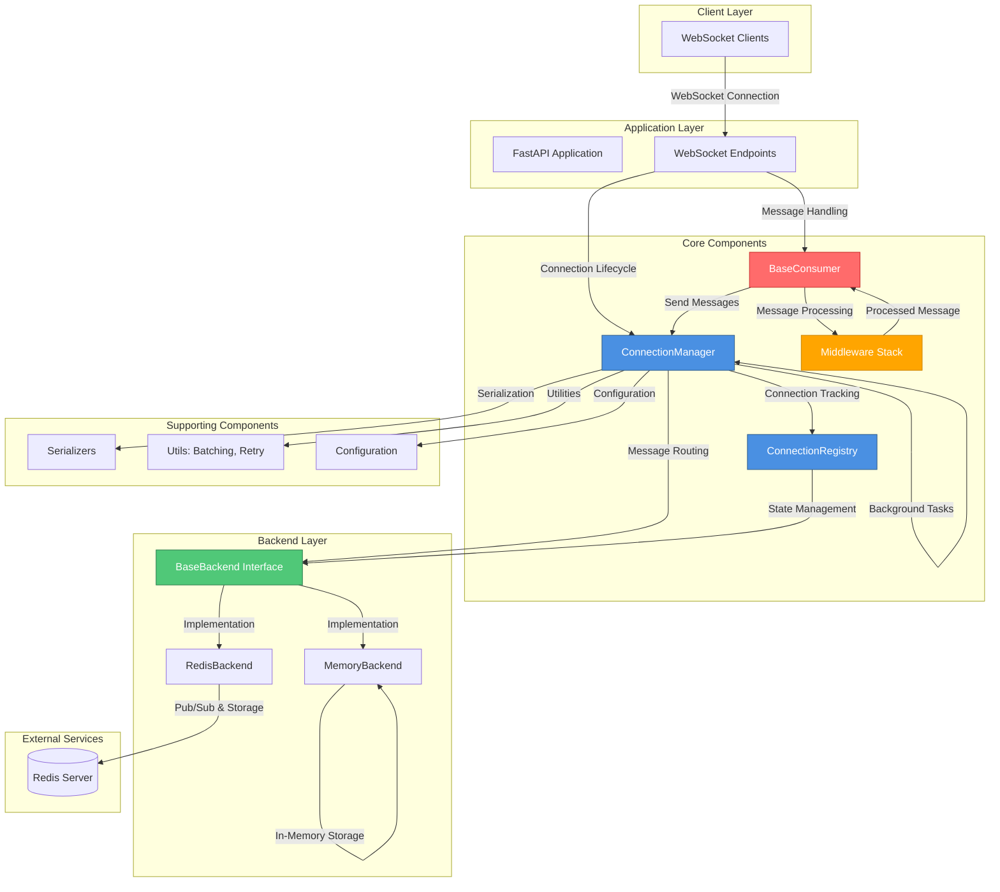
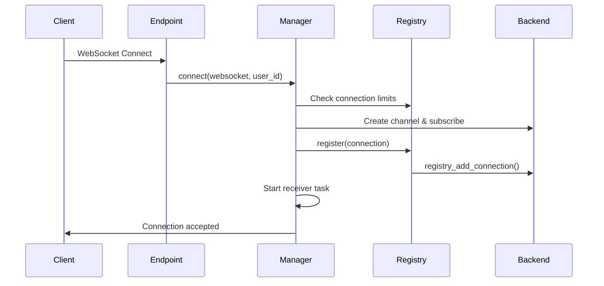
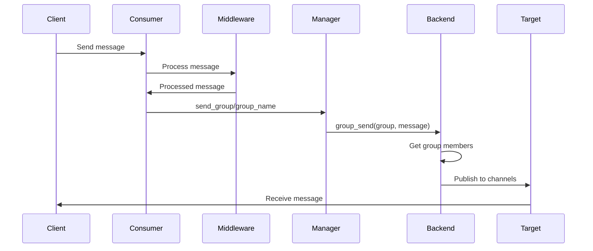

# AgentCore

A high-performance, distributed WebSocket messaging system built with FastAPI. AgentCore provides a robust foundation for real-time applications with support for single-server and multi-server deployments, group messaging, connection management, and extensible middleware.

## Features

- **WebSocket Connection Management**: Robust connection lifecycle management with heartbeat monitoring and automatic cleanup
- **Distributed Architecture**: Support for both in-memory (single-server) and Redis-backed (multi-server) deployments
- **Group Messaging**: Efficient group-based messaging with cross-server support
- **Broadcast Messaging**: Global message broadcasting across all connections
- **Connection Limits**: Configurable per-user and total connection limits
- **Middleware Support**: Chainable middleware for message processing, validation, rate limiting, and logging
- **Heartbeat Monitoring**: Automatic connection health checks and dead connection cleanup
- **Serialization**: Flexible message serialization (JSON, orjson, pickle)
- **Error Handling**: Structured error responses with context and error codes
- **Statistics & Monitoring**: Built-in connection statistics and activity tracking

## Architecture



## System Components

### ConnectionManager

The central orchestrator for WebSocket connections. Manages:
- Connection establishment and teardown
- Group membership management
- Message routing (personal, group, broadcast)
- Heartbeat monitoring and cleanup
- Connection limits enforcement
- Background task coordination (heartbeat, statistics, broadcast)

### ConnectionRegistry

Maintains an in-memory registry of active connections and coordinates with the backend for distributed state management:
- Local connection state tracking
- User-to-connection mapping
- Group membership management
- Backend synchronization for cross-server visibility

### Backend Layer

Abstract interface (`BaseBackend`) with two implementations:

**MemoryBackend**: Single-server deployment
- In-memory storage for channels and groups
- Fast local lookups
- No external dependencies

**RedisBackend**: Distributed deployment
- Redis pub/sub for message passing
- Persistent group memberships
- Cross-server connection registry
- Broadcast channel support
- Configurable TTL for registry keys

### Consumer System

`BaseConsumer` provides the foundation for application-specific WebSocket handlers:
- Connection lifecycle hooks (`connect()`, `disconnect()`, `receive()`)
- Automatic message parsing and validation
- Group management helpers
- Error handling with structured responses

### Middleware

Chainable middleware for message processing:
- **ValidationMiddleware**: Message format validation
- **RateLimitMiddleware**: Rate limiting per connection/user
- **LoggingMiddleware**: Request/response logging
- Custom middleware support via `Middleware` base class

## Data Flow

### Connection Establishment



### Message Routing



## Configuration

Configuration is managed via environment variables or `.env` file:

```python
BACKEND_TYPE=redis                    # "memory" or "redis"
REDIS_URL=redis://localhost:6379/0
REDIS_CHANNEL_PREFIX=ws:
WS_HEARTBEAT_INTERVAL=30             # seconds
WS_HEARTBEAT_TIMEOUT=60              # seconds
MAX_CONNECTIONS_PER_CLIENT=5
MAX_TOTAL_CONNECTIONS=10000
SERVER_INSTANCE_ID=server-abc123     # Auto-generated if not set
LOG_LEVEL=INFO
```

## Usage Example

### Complete Application Setup

```python
from contextlib import asynccontextmanager
from fastapi import FastAPI, WebSocket, WebSocketDisconnect
from core.config import Settings
from core.connections.manager import ConnectionManager
from core.connections.registry import ConnectionRegistry
from core.backends.redis import RedisBackend
from core.backends.memory import MemoryBackend
from core.consumer.base import BaseConsumer
from core.middleware.validation import ValidationMiddleware
from core.middleware.rate_limit import RateLimitMiddleware
from core.middleware.logging import LoggingMiddleware
from core.typed import Message

# Load configuration from environment
settings = Settings()

# Choose backend based on configuration
if settings.BACKEND_TYPE == "redis":
    backend = RedisBackend(
        redis_url=settings.REDIS_URL,
        channel_prefix=settings.REDIS_CHANNEL_PREFIX,
        registry_expiry=settings.REDIS_REGISTRY_EXPIRY,
        group_expiry=settings.REDIS_GROUP_EXPIRY,
    )
else:
    backend = MemoryBackend()

# Initialize registry and manager
registry = ConnectionRegistry(
    max_connections=settings.MAX_TOTAL_CONNECTIONS,
    heartbeat_timeout=settings.WS_HEARTBEAT_TIMEOUT,
    backend=backend,
)

manager = ConnectionManager(
    registry=registry,
    max_connections_per_client=settings.MAX_CONNECTIONS_PER_CLIENT,
    heartbeat_interval=settings.WS_HEARTBEAT_INTERVAL,
    server_instance_id=settings.SERVER_INSTANCE_ID,
)

# Build middleware chain
middleware = (
    ValidationMiddleware(settings.WS_MAX_MESSAGE_SIZE)
    >> RateLimitMiddleware(enabled=True, messages_per_window=10, window_seconds=60)  # 10 messages per minute
    >> LoggingMiddleware()
)

# Define consumer
class ChatConsumer(BaseConsumer):
    async def connect(self) -> None:
        """Handle connection establishment"""
        user_id = self.connection.user_id
        
        # Join default room
        await self.join_group("general")
        
        # Send welcome message
        await self.send_json({
            "type": "welcome",
            "message": f"Welcome, {user_id}!",
            "user_id": user_id,
        })
        
        # Notify others in room
        await self.send_to_group("general", {
            "type": "user_joined",
            "user_id": user_id,
        })
    
    async def receive(self, message: Message) -> None:
        """Handle incoming messages"""
        msg_type = message.type

        if msg_type == "chat_message":
            # Send message to group
            await self.send_to_group("general", {
                "type": "chat_message",
                "user_id": self.connection.user_id,
                "text": message.data.get("text"),
                "timestamp": message.data.get("timestamp"),
            })

        elif msg_type == "join_room":
            # Join a specific room
            room = message.data.get("room")
            if room:
                await self.join_group(room)
                await self.send_json({
                    "type": "room_joined",
                    "room": room,
                })

        elif msg_type == "leave_room":
            # Leave a room
            room = message.data.get("room")
            if room and room in self.connection.groups:
                await self.leave_group(room)
                await self.send_json({
                    "type": "room_left",
                    "room": room,
                })

        elif msg_type == "private_message":
            # Send personal message to another user
            target_user_id = message.data.get("target_user_id")
            text = message.data.get("text")

            if target_user_id and text:
                # Send to target user's connections
                await self.manager.send_to_user(target_user_id, {
                    "type": "private_message",
                    "from_user_id": self.connection.user_id,
                    "to_user_id": target_user_id,
                    "text": text,
                    "timestamp": message.data.get("timestamp"),
                })

        elif msg_type == "broadcast":
            # Broadcast to all connections (admin feature)
            await self.manager.broadcast({
                "type": "announcement",
                "message": message.data.get("message"),
                "from_user_id": self.connection.user_id,
                "timestamp": message.data.get("timestamp"),
            })

        elif msg_type == "typing_start":
            # User started typing - notify others in room
            room = message.data.get("room", "general")
            if room in self.connection.groups:
                await self.manager.send_group_except(
                    room,
                    {
                        "type": "user_typing_start",
                        "user_id": self.connection.user_id,
                        "room": room,
                        "timestamp": message.data.get("timestamp"),
                    },
                    exclude_connection_id=self.connection.channel_name,
                )

        elif msg_type == "typing_stop":
            # User stopped typing - notify others in room
            room = message.data.get("room", "general")
            if room in self.connection.groups:
                await self.manager.send_group_except(
                    room,
                    {
                        "type": "user_typing_stop",
                        "user_id": self.connection.user_id,
                        "room": room,
                        "timestamp": message.data.get("timestamp"),
                    },
                    exclude_connection_id=self.connection.channel_name,
                )
    
    async def disconnect(self, code: int) -> None:
        """Handle disconnection"""
        # Leave all groups
        for group in list(self.connection.groups):
            await self.leave_group(group)

        # Notify others
        await self.send_to_group("general", {
            "type": "user_left",
            "user_id": self.connection.user_id,
        })

        await super().disconnect(code)

# FastAPI application with lifespan management
@asynccontextmanager
async def lifespan(app: FastAPI):
    # Start background tasks (heartbeat, statistics, broadcast)
    await manager.start_tasks()
    yield
    # Graceful shutdown
    await manager.stop_tasks()

app = FastAPI(title="AgentCore Chat", lifespan=lifespan)

@app.websocket("/ws/{user_id}")
async def websocket_endpoint(websocket: WebSocket, user_id: str):
    # Establish connection
    connection = await manager.connect(
        websocket=websocket,
        user_id=user_id,
        metadata={"ip": websocket.client.host if websocket.client else None}
    )
    
    # Create consumer with middleware
    consumer = ChatConsumer(
        connection=connection,
        manager=manager,
        middleware_stack=middleware,
    )
    
    try:
        # Call consumer connect hook
        await consumer.connect()
        
        # Message loop
        while True:
            raw_message = await websocket.receive_text()
            await consumer.handle_message(raw_message)
    
    except WebSocketDisconnect:
        # Normal disconnection
        await consumer.disconnect(1000)
        await manager.disconnect(connection.channel_name)
    
    except Exception as e:
        # Error handling
        print(f"WebSocket error: {e}")
        await consumer.disconnect(1011)  # Internal error code
        await manager.disconnect(connection.channel_name)
```

### Key Features Demonstrated

1. **Backend Selection**: Automatic backend selection based on configuration (Memory or Redis)
2. **Configuration Management**: Using `Settings` class for environment-based configuration
3. **Middleware Chain**: Chained middleware for validation, rate limiting, and logging
4. **Group Messaging**: Join/leave groups and send messages to groups
5. **Personal Messaging**: Send messages to specific users across all their connections
6. **Broadcast Messaging**: Send messages to all active connections
7. **Typing Indicators**: Real-time typing status notifications using `send_group_except` to exclude sender
8. **Connection Lifecycle**: Proper connection establishment, message handling, and cleanup
9. **Lifespan Management**: Background task management with FastAPI lifespan context

## Key Design Decisions

1. **Backend Abstraction**: The `BaseBackend` interface allows seamless switching between memory and Redis backends without changing application code.

2. **Distributed State**: Redis backend uses atomic operations (Lua scripts) to ensure consistency across server instances for connection limits and registry updates.

3. **Connection Lifecycle**: Comprehensive lifecycle management with heartbeat monitoring, automatic cleanup, and graceful shutdown.

4. **Middleware Chain**: Chainable middleware pattern allows flexible message processing pipelines.

5. **Batch Processing**: Utilities for efficient batch processing of connections to handle large-scale deployments.

6. **Error Handling**: Structured error responses with context and error codes for better debugging and client handling.

## Requirements

- Python >= 3.11
- FastAPI >= 0.124.0
- Redis >= 7.1.0 (for distributed deployment)
- Pydantic Settings >= 2.12.0
